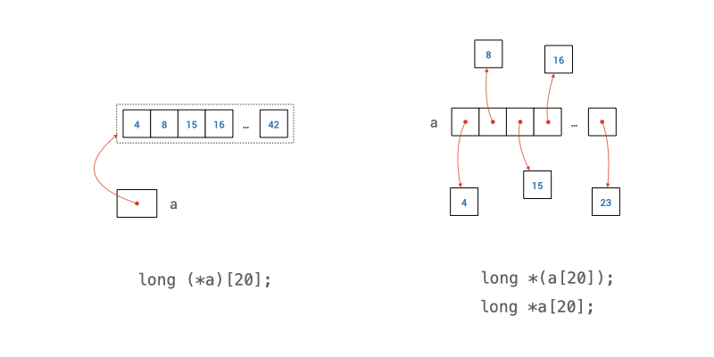
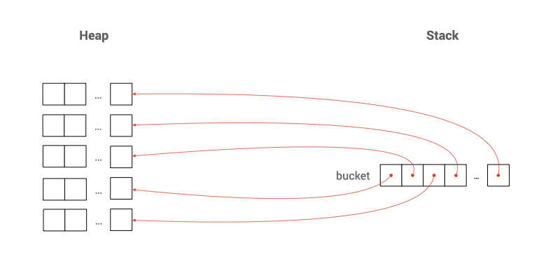
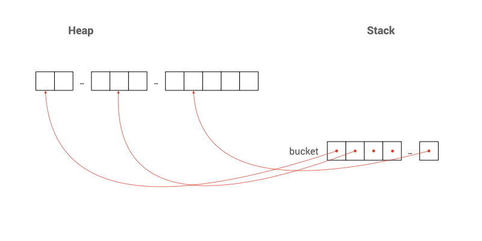

# Unit 19: Multi-Dimensional Arrays

## Learning Objectives

After completing this unit, students should:

- be comfortable reading and writing code that involves multi-dimensional arrays
- be able to declare and allocate multi-dimensional arrays on the stack and the heap
- be able to decide when to use a fixed-size multi-dimensional array, a dynamically-sized multi-dimensional array, or a mixture of the two
- understand how we can pass a multi-dimensional array into a function
- understand the differences in C syntax, between an array of pointers and a pointer to an array.
- be able to declare and allocate jagged arrays

## Fixed-size 2D Array

At the beginning of Unit 14, we say that an array can hold one or more values of some type $T$.  $T$ can be any type, including an array!  So, we can have an array where each element is another array.

For instance,
```C
long matrix[10][20];
```

Here, we have an array of 10 elements, and each element is an array of 20 `long` values.

When we access the elements in the array, we can use the notation `matrix[i][j]`.  This notation is actually a simpler form of `(matrix[i])[j]`  -- `matrix[i]` refers the `i+1`-th element in `matrix`, which is an array of 20 elements. So `(matrix[i])[j]` accesses the `j+1`-th element in this array of 20 elements.

Such an array is called a two-dimensional array, or 2D array.  We can have a 3D array, 4D array, and so on.

We have seen three types of arrays.  On the stack, we have fixed-length arrays and variable-length arrays.  On the heap, we have dynamically allocated arrays.  A 2D array can mix different types of arrays.  Since we ban the use of variable length arrays, we will focus on fixed-length arrays and dynamically allocated arrays only.

The example `matrix` above is a fixed-length 2D array.  In the memory, a continuous space to store 200 `long` values is been allocated.  We can visualize this as having 10 rows of `long` array, each array contains 20 columns of `long` values.

Since `matrix[i]` is an array in the example above, `matrix[i]` decays to `&matrix[i][0]`, the address of the first element in matrix[i].  After decay, `matrix[i]` can be treated as having the type `long *`.

Further, since `matrix[i]` is a 1D array, we can pass `matrix[i]`, which is one of the rows in `matrix`, just like a normal 1D array:

```C
void bar(size_t num_of_cols, long matrix_row[num_of_cols]) { .. }
void bar(size_t num_of_cols, long matrix_row[]) { .. }
void bar(size_t num_of_cols, long* matrix_row) { .. }
```

We can then invoke the function `bar` like:

```C
bar(20, matrix[i]);
```

Things get a bit tricky when we want to pass a 2D array into a function.  By array decay, when we use the array name `matrix`, it is equivalent to `&matrix[0]`, which is the address of the first element in `matrix`, which is the memory address of an array of 20 `long` elements.

### Pointer to Array

Since an array in C consists only of a contiguous region of memory that stores the elements of the array, the address of an array is the same as the address of the first element of the array.

The following five statements would print out exactly the same values.
```C
cs1010_println_pointer(matrix);
cs1010_println_pointer(matrix[0]);
cs1010_println_pointer(&matrix);
cs1010_println_pointer(&matrix[0]);
cs1010_println_pointer(&matrix[0][0]);
```

We have seen that `matrix[0]` and `&matrix[0][0]` both are memory addresses of a `long` value.  The variable `matrix` and `&matrix[0]`, however, have the type memory address of a `long` _array_.  To declare a variable `a` that is the memory address of an array, we write:

```C
long (*a)[20];
```

We can understand this as follows: `(*a)` is an array of 20 long values.  `*` is the deference operator to an address, so `a` must then be a memory address of an array of 20 long values.

C is very particular about the type of an array.  An array of 20 long values is different from an array of 19 long values.  Trying to point a pointer to an array of 20 `long` elements to an array of 19 `long` elements would lead to error:
```C
long x[19];
long y[20];
long (*a)[20];
a = &x; // error
a = &y; // ok
```

In other words, the size of a fixed-size array is part of the type information.

To pass a 2D array into a function, say `foo`, we can write 

```C
void foo(size_t num_of_rows, size_t num_of_cols, long matrix_row[num_of_rows][20]) { .. }
void foo(size_t num_of_rows, size_t num_of_cols, long matrix_row[10][20]]) { .. }
void foo(size_t num_of_rows, size_t num_of_cols, long matrix_row[][20]]) { .. }
void foo(size_t num_of_rows, size_t num_of_cols, long (*matrix_row)[20]) { .. }
```

Here, we cannot omit the number `20` since it is part of the type information.  

With the declaration above, we can then call the function `foo` and pass in the 2D array as such:
```C
foo(10, 20, matrix);
```

Note that the position of the parentheses when we declare a variable that is a pointer to an array is important and is not optional.  If we write it as either:
```C
long *a[20];
long *(a[20]);
```

then we are declaring `a` as an array of 20 pointers to long instead!  We will see such declaration in use in the next section.



## Fixed Size Array of Dynamically Allocated Array

Suppose that we know only one of the dimensions of the array in advance, but not the other dimension.  We can allocate a fixed-length array for the known dimension, and allocate the other dimension dynamically using `calloc`.  We can declare an array like this:

```C
double *buckets[10];
size_t num_of_cols = cs1010_read_size_t();
for (long i = 0; i < 10; i += 1) {
  buckets[i] = calloc(num_of_cols, sizeof(double));
}
```



Here, `bucket` is a 1D array of 10 pointers to `double`.  So, we can easily pass `bucket` to a function just like any other 1D array:

- `void baz(size_t num_of_rows, size_t num_of_cols, double **bucket)`
- `void baz(size_t num_of_rows, size_t num_of_cols, double *bucket[])`
- `void baz(size_t num_of_rows, size_t num_of_cols, double *bucket[num_of_cols])`

Accessing individual elements in such type of array is no different from accessing a fixed-length 2D array: we use `bucket[i][j]`.

Just like a dynamically allocated 1D array, we need to free the allocated memory after we are done:

```C
for (size_t i = 0; i < 10; i += 1) {
  free(buckets[i]);
}
```

### Dealing with Allocation Failures

Just like a dynamically allocated 1D array, we need to deal with the possibility that memory allocation can fail.  To do this, we need to check if each `calloc` is successful or not.  In case one of the memory allocations fails, then we would have a partially allocated 2D array.  We will need to deallocate all those partially allocated memory with `free`.

```C
double *buckets[10];
size_t num_of_cols = cs1010_read_size_t();
for (size_t i = 0; i < 10; i += 1) {
  buckets[i] = calloc(num_of_cols, sizeof(double));
  if (buckets[i] == NULL) {
    cs1010_println_string("unable to allocate array");
	for (size_t j = 0; j < i; j += 1) {
	  free(buckets[j]);
	}
	return 1;
  }
}
```

An alternative is to allocate a single contiguous region of memory with a single `calloc` call, and then point the pointers in our array in the right memory location.

```C
double *buckets[10];
size_t num_of_cols = cs1010_read_size_t();
buckets[0] = calloc(num_of_cols * 10, sizeof(double));
if (buckets[0] == NULL) {
  cs1010_println_string("unable to allocate array");
  return 1;
}
for (size_t i = 1; i < 10; i += 1) {
  buckets[i] = buckets[i - 1] + num_of_cols;
}
```




## Dynamically Size 2D Array

Suppose that we do not know both dimensions in advance, then we can allocate both dimensions of the array dynamically on the heap.

```C
double **canvas;
size_t num_of_rows = cs1010_read_size_t();
size_t num_of_cols = cs1010_read_size_t();
canvas = calloc(num_of_rows, sizeof(double *)); // note the call to sizeof
for (size_t i = 0; i < num_of_rows; i += 1) {
  canvas[i] = calloc(num_of_cols, sizeof(double));
  if (canvas[i] == NULL) {
    cs1010_println_string("unable to allocate array");
	for (size_t j = 0; j < i; j += 1) {
      free(canvas[j]);
	}
	free(canvas);
  }
}
```


Passing such an array into a function is no different from a 2D array where only one dimension is dynamically allocated above.

Remember to free the allocated memory for both dimensions after we are done, as well as if one of the rows encounters an error.

```C
for (size_t i = 0; size_t i < num_of_rows; i += 1) {
  free(canvas[i]);
}
free(canvas);
```

Note that during the deallocation of memory, we need to do it in the reverse order of memory allocation.  If we call `free(canvas)` first, we are no longer guaranteed to be able to access `canvas[i]` with the correct pointers inside, so calling `free(canvas[i])` after `free(canvas)` might lead to an error.

Just like before, there is an alternative where we can also allocate a single contiguous region of memory with a single `calloc` call, and then point the pointers in our array in the right memory location.

```C
double **canvas;
size_t num_of_rows = cs1010_read_size_t();
size_t num_of_cols = cs1010_read_size_t();
canvas = calloc(num_of_rows, sizeof(double *));
if (canvas == NULL) {
  cs1010_println_string("unable to allocate memory");
  return 1;
}
canvas[0] = calloc(num_of_rows * num_of_cols, sizeof(double));
if (canvas[0] == NULL) {
  cs1010_println_string("unable to allocate memory");
  free(canvas);
  return 1;
}

for (size_t i = 1; i < num_of_rows; i += 1) {
  canvas[i] = canvas[i-1] + num_of_cols;
}
```

If we allocate a single contiguous region of memory for `canvas`, then we only need to `free(canvas[0])` and `free(canvas)` once we are done.

## Jagged Array

One advantage of using a dynamically allocated array is that it allows a jagged 2D array, where each row has a different size.  The example below allocate memory for a 2D array that is shaped like a half-square: the first row has one element, the second row has two elements, the third row has three, and so on.

```C
double *half_square[10];
for (size_t i = 0; i < 10; i += 1) {
  half_square[i] = calloc(i+1, sizeof(double));
}
```

## Initializing a Multidimensional Array

Just like a 1D-array, we can initialize a multi-dimensional array with initializers during declaration:

```C
long matrix[3][3] = {
    {1, 0, -1},
    {-1, 1, 0},
    {0, -1, 1}
};
```
Note that we use nested `{` and `}` here.  There are other variations to the syntax above, which you may read up on your own if you are interested as we do not need to write complex initializers for multi-dimensional arrays that often.

## Problem Set
### Problem 19.1

Suppose we have a 2D array 
```C
   long m[3][3];
   long *n = &m[0][0];
   m[0][3] = 3; // warning
   n[3] = 10;
```

Suppose we ignore the compile warning generated by the code above and execute the program anyway.  Explain what happens when Line 3 and Line 4 are executed.

### Problem 19.2

We need to represent the distance in km between every major city in the world. Let's label every city with a number, ranging from 0 .. $n-1$, where $n$ is the number of cities.  The distance between city $i$ and $j$ is the same as the distance between city $j$ and $i$.  The distance can be represented with `long`.

Explain how you would represent this information using a jagged two-dimensional array in C efficiently.  We have information about a few thousand cities to store.

Explain how you would write a function `long dist(long **d, long i, long j)` to retrieve the distance between any two cities $i$ and $j$.
